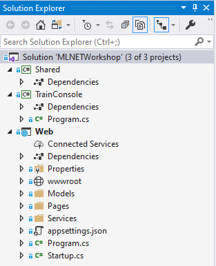

In this section you'll set up your environment to build machine learning applications with ML .NET. [ML.NET](https://dot.net/ml) is a cross-platform, machine learning framework for .NET developers.

## Requirements

- [Git (Optional)](https://git-scm.com/)

### Windows

- [Visual Studio 2019](https://visualstudio.microsoft.com/vs/) with .NET Core workload installed.
- [Model Builder enabled](https://github.com/dotnet/machinelearning-modelbuilder/issues/757#issuecomment-631665947).

### Mac / Linux

- [.NET Core 3.1 SDK](https://dotnet.microsoft.com/download/dotnet-core/3.1)
- [ML.NET CLI](https://www.nuget.org/packages/MLNet/)
- [Visual Studio Code (Optional)](https://code.visualstudio.com/Download)
- [.NET Core 2.1 SDK](https://aka.ms/download-netcore-21)

## Clone or download the starter application

We've set up an initial project for you to start from. You just need to clone this repo to your machine and then open it up in Visual Studio or your editor of choice. A simple way to clone the application is to run this command from a command line terminal:

```powershell
git clone https://github.com/luisquintanilla/mlnet-workshop
```

Alternatively, you can download a [zipped version of the project](https://github.com/luisquintanilla/mlnet-workshop/archive/master.zip) and unzip that.

Once you've done this, change directories to the *mlnet-workshop/src* folder where you'll find the *MLNETWorkshop.sln* file. Open the solution. You should see three projects, similar to what's shown here:



## Build the application

At this point you should be able to build the solution for the first time, which you can do from Visual Studio or the command line with `dotnet build` from the root of the `src` folder.