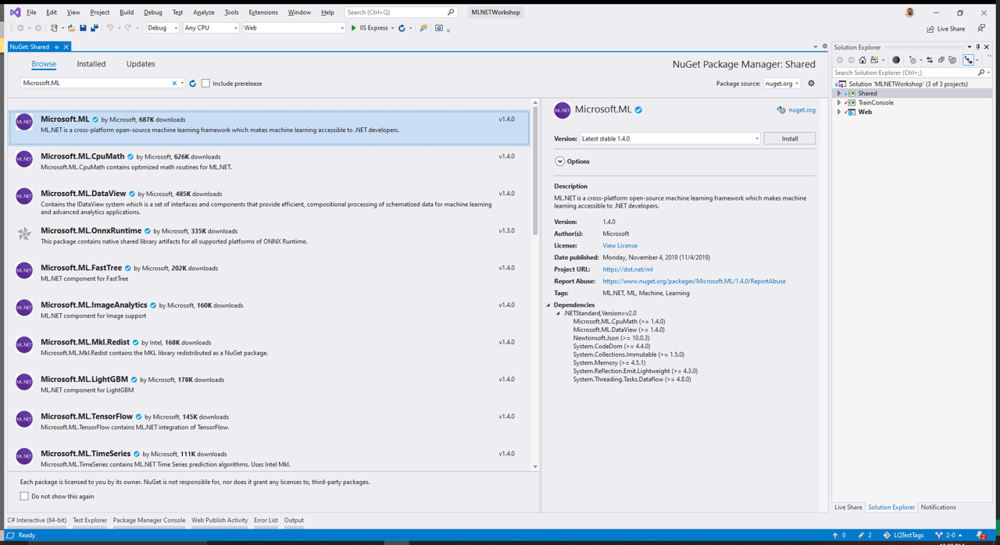

In this session, you'll add an `MLContext` to the `TrainConsole` project. `MLContext` is the starting point for all ML.NET operations. It provides a way to create components for:

- Data preparation
- Feature engineering
- Training
- Prediction
- Model evaluation
- Logging
- Execution control
- Seeding

## Install the ML.NET Nuget Package

First, we need to add the ML.NET NuGet package to the `Shared` project. If you're using Visual Studio, right click on the project name and select **Manage NuGet Dependencies**. Then click the "Browse" tab and search for `Microsoft.ML`. Make sure to install version **1.5.0**.



Alternately if you prefer working from the command line, you can run this command from the *src/TrainConsole* folder:

```powershell
dotnet add package Microsoft.ML -v 1.5.0
```

## Initialize MLContext

Open the `Program.cs` file in the `TrainConsole` project and add the following `using` statement at the top of the file to reference the `Microsoft.ML` package.

```csharp
using Microsoft.ML;
```

Next, create an instance of `MLContext` in the `Main` method (replace the "Hello World" line):

```csharp
static void Main(string[] args)
{
    MLContext mlContext = new MLContext();
    //...
}
```


At this point we're not yet ready to work with the `MLContext`, but you should be able to successfully build the application once more.