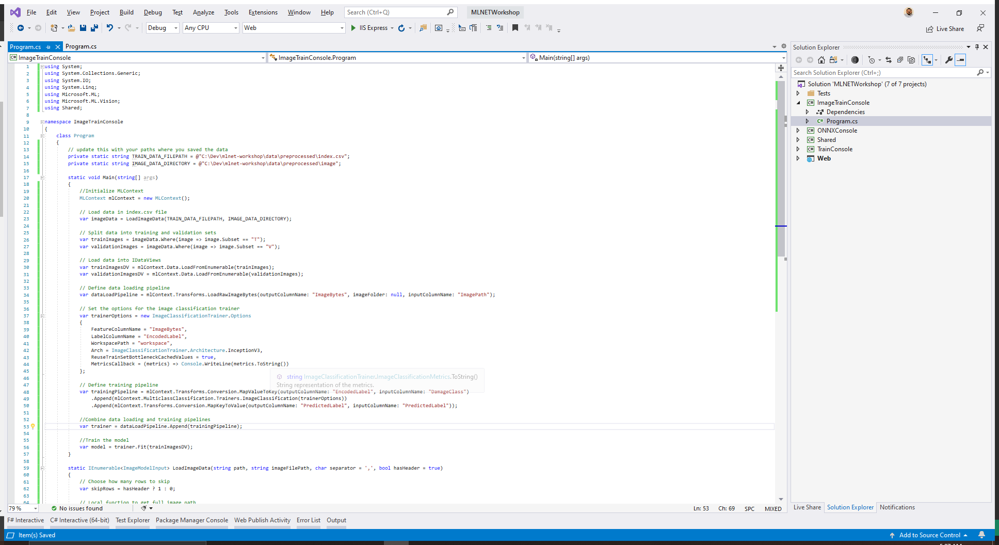

Once you have your pipeline defined, use `Fit` to train the model.

```csharp
// Train the model
var model = trainer.Fit(trainImagesDV);
```



The Image Classification API starts the training process by loading a pretrained TensorFlow model. The training process consists of two steps:

1. Bottleneck phase
2. Training phase


### Bottleneck phase

During the bottleneck phase, the set of training images is loaded and the pixel values are used as input, or features, for the frozen layers of the pretrained model. The frozen layers include all of the layers in the neural network up to the penultimate layer, informally known as the bottleneck layer. These layers are referred to as frozen because no training will occur on these layers and operations are pass-through. It's at these frozen layers where the lower-level patterns that help a model differentiate between the different classes are computed. The larger the number of layers, the more computationally intensive this step is. Fortunately, since this is a one-time calculation, the results can be cached and used in later runs when experimenting with different parameters.

### Training phase

Once the output values from the bottleneck phase are computed, they are used as input to retrain the final layer of the model. This process is iterative and runs for the number of times specified by model parameters. During each run, the loss and accuracy are evaluated. Then, the appropriate adjustments are made to improve the model with the goal of minimizing the loss and maximizing the accuracy. Once training is finished, two model formats are output. One of them is the `.pb` version of the model and the other is the `.zip` ML.NET serialized version of the model. When working in environments supported by ML.NET, it is recommended to use the `.zip` version of the model. However, in environments where ML.NET is not supported, you have the option of using the `.pb` version.

The output of this phase should look something like the following:

```text
2020-07-24 05:26:24.836060: I tensorflow/core/platform/cpu_feature_guard.cc:143] Your CPU supports instructions that this TensorFlow binary was not compiled to use: AVX2
2020-07-24 05:26:24.861675: I tensorflow/compiler/xla/service/service.cc:168] XLA service 0x1e7a01d1e90 initialized for platform Host (this does not guarantee that XLA will be used). Devices:
2020-07-24 05:26:24.873356: I tensorflow/compiler/xla/service/service.cc:176]   StreamExecutor device (0): Host, Default Version
Saver not created because there are no variables in the graph to restore
Phase: Bottleneck Computation, Dataset used:      Train, Image Index:   1
Phase: Bottleneck Computation, Dataset used:      Train, Image Index:   2
Phase: Bottleneck Computation, Dataset used:      Train, Image Index:   3
Phase: Bottleneck Computation, Dataset used:      Train, Image Index:   4
Phase: Bottleneck Computation, Dataset used:      Train, Image Index:   5
Phase: Bottleneck Computation, Dataset used:      Train, Image Index:   6
Phase: Bottleneck Computation, Dataset used:      Train, Image Index:   7
Phase: Bottleneck Computation, Dataset used:      Train, Image Index:   8
Phase: Bottleneck Computation, Dataset used:      Train, Image Index:   9
...
Phase: Training, Dataset used:      Train, Batch Processed Count: 115, Epoch:  31, Accuracy:  0.9869566, Cross-Entropy: 0.122196294, Learning Rate: 0.0037157428
Phase: Training, Dataset used: Validation, Batch Processed Count:  13, Epoch:  31, Accuracy: 0.76263744, Cross-Entropy: 0.63454604
Phase: Training, Dataset used:      Train, Batch Processed Count: 115, Epoch:  32, Accuracy:  0.9869566, Cross-Entropy: 0.12009087, Learning Rate: 0.0037157428
Phase: Training, Dataset used: Validation, Batch Processed Count:  13, Epoch:  32, Accuracy: 0.75494516, Cross-Entropy: 0.63655174
Saver not created because there are no variables in the graph to restore
Restoring parameters from workspace\custom_retrained_model_based_on_inception_v3.meta
Froze 2 variables.
Converted 2 variables to const ops.
```