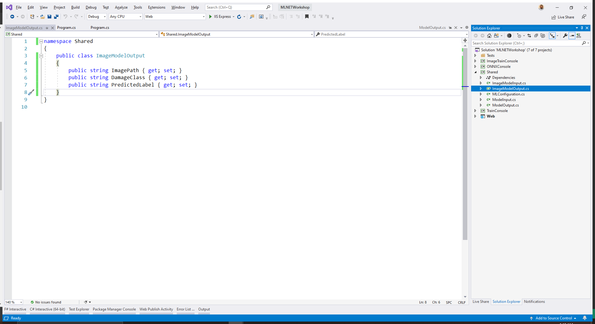

In this section, you will evaluate how well your model performs on the validation dataset.

The evaluation metric used to measure model performance depends on the task. The task in this application is multiclass classification. Some common regression metrics are:

- Micro-accuracy (Closer to 1 is better)
- Macro-accuracy (Close to 1 is better)
- Log-loss (Closer to 0 is better)
- Log-loss reduction (Greater than 0 is better)

Learn more about [multiclass classification evaluation metrics](https://docs.microsoft.com/dotnet/machine-learning/resources/metrics#evaluation-metrics-for-multi-class-classification).

To evaluate your model, start off by using the model to make predictions on the validation images. In the `Main` method of the *Program.cs* file inside the `ImageTrainConsole` project, use the `Transform` method.

```csharp
// Use the model to make predictions on the validation images
var predictionsDV = model.Transform(validationImagesDV);
```

Evaluate the model and output the macro-accuracy to the console.

```csharp
// Evaluate the model
var evaluationMetrics = mlContext.MulticlassClassification.Evaluate(predictionsDV, labelColumnName: "EncodedLabel");
Console.WriteLine($"Train Set Macro Accuracy: {evaluationMetrics.MacroAccuracy}");
```

The output should look something like the following:

```text
Train Set Macro Accuracy: 0.6810376171767301
```

### Compare actual against predicted values

Start off by defining the model output schema. In the `Shared` project, create a new class called `ImageModelOutput` and define it as follows:

```csharp
public class ImageModelOutput
{
    public string ImagePath { get; set; }
    public string DamageClass { get; set; }
    public string PredictedLabel { get; set; }
}
```



To make it easier to inspect the predicted values, convert the `predictionsDV` `IDataView` to an `IEnumerable`. Because we plan on lazily iterating over the collection, we set the `reuseRowObject` parameter to `true`.

```csharp
// Convert IDataView to IEnumerable
var predictions = mlContext.Data.CreateEnumerable<ImageModelOutput>(predictionsDV, reuseRowObject: true);
```

Iterate over the predictions and compare the actual values to the predicted values by displaying them in the console.

```csharp
//Iterate over predictions and display actual vs predicted values
foreach (var prediction in predictions)
{
    var fileName = Path.GetFileName(prediction.ImagePath);
    Console.WriteLine($"Image: {fileName} | Actual: {prediction.DamageClass} | Predicted: {prediction.PredictedLabel}");
}
```


The output should look something like the following:

```text
Image: 1366.jpeg | Actual: bumper_scratch | Predicted: bumper_scratch
Image: 1392.jpeg | Actual: bumper_scratch | Predicted: bumper_scratch
Image: 1399.jpeg | Actual: bumper_scratch | Predicted: door_dent
Image: 1431.jpeg | Actual: bumper_scratch | Predicted: bumper_scratch
Image: 1437.jpeg | Actual: bumper_scratch | Predicted: tail_lamp
Image: 1497.jpeg | Actual: bumper_scratch | Predicted: bumper_scratch
Image: 1500.jpeg | Actual: bumper_scratch | Predicted: bumper_scratch
```