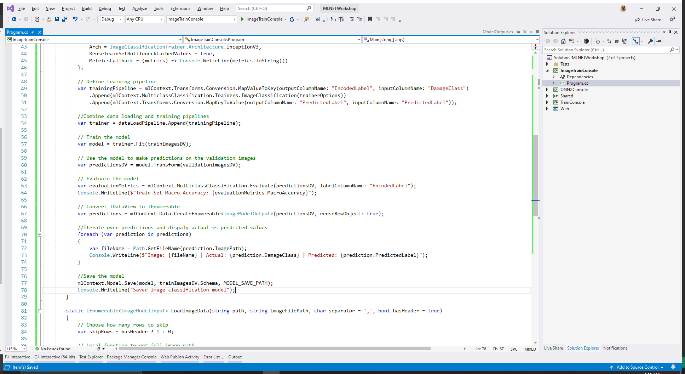

Once you're satisfied with your model, save it to your PC.

Inside of the *Program* class definition of the `ImageTrainConsole` project, add the path where you want to save your model to. The model is serialized and stored as a `.zip` file. In this case, the model will be saved to a file called *ImageModel.zip*.

```csharp
private static string MODEL_FILEPATH = @"C:\Dev\ImageModel.zip";
```

Then, inside the `Main` method, add the following code at the bottom:

```csharp
//Save the model
mlContext.Model.Save(model, trainImagesDV.Schema, MODEL_SAVE_PATH);
Console.WriteLine("Saved image classification model");
```



Set the startup project to `ImageTrainConsole` and run the application.

Congratulations! You have now trained a custom image classification model with ML.NET.

## Additional resources

- [Build an image classification model in under 10 minutes with Model Builder and Azure](https://www.youtube.com/watch?v=G_ZJZdKLNMc&)
- [How to train an image classification model with Model Builder](https://devblogs.microsoft.com/dotnet/train-image-classification-model-azure-mlnet-model-builder/)
- [Train a custom deep learning model to identify damaged infrastructure](https://docs.microsoft.com/dotnet/machine-learning/tutorials/image-classification-api-transfer-learning)
- [Detect objects using ONNX in ML.NET](https://docs.microsoft.com/dotnet/machine-learning/tutorials/object-detection-onnx)
- [Classify sentiment using TensorFlow](https://docs.microsoft.com/dotnet/machine-learning/tutorials/text-classification-tf)