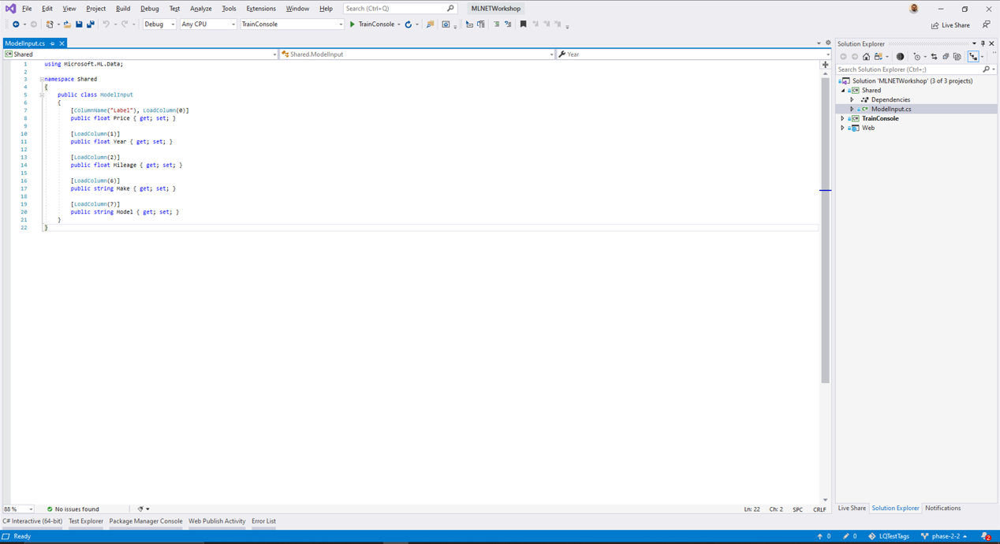

In the `Shared` project, add a new class called `ModelInput` to the root directory. This class will consist solely of properties and will be mapped from the data file. Each property will reference a column using a 0-based index.

Start by adding the following `using` statement:

```csharp
using Microsoft.ML.Data;
```

Then, define the class as follows:

```csharp
public class ModelInput
{
    [ColumnName("Label"), LoadColumn(0)]
    public float Price { get; set; }

    [LoadColumn(1)]
    public float Year { get; set; }

    [LoadColumn(2)]
    public float Mileage { get; set; }

    [LoadColumn(6)]
    public string Make { get; set; }

    [LoadColumn(7)]
    public string Model { get; set; }
}
```



> Note that not all columns are loaded. Each `LoadColumn` attribute specifies the index of its respective column within the file. The `ColumnName` attribute tells the `IDataView` to identify the `Price` property by the `Label` column. The ground-truth values or the value to predict is known as the **label**. Since we want to be able to predict the price, we treat that as the label. The rest of the columns or inputs are known as **features**. Learn more about [data annotations](https://docs.microsoft.com/dotnet/machine-learning/how-to-guides/load-data-ml-net#annotating-the-data-model-with-column-attributes) and [expected column types](https://docs.microsoft.com/dotnet/machine-learning/how-to-guides/train-machine-learning-model-ml-net#working-with-expected-column-types).