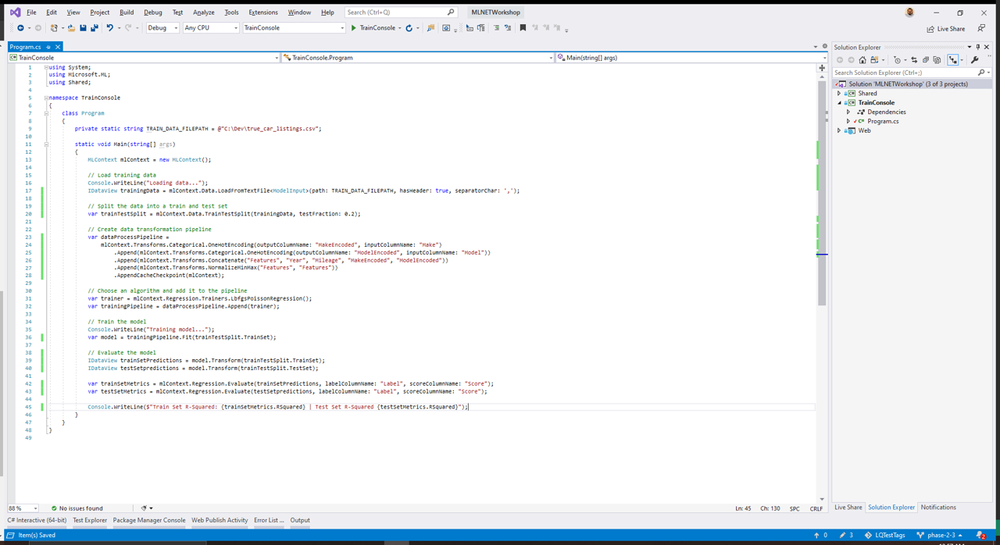

## Evaluation metrics

The evaluation metric used to measure model performance depends on the task. The task in this application is regression. Some common regression metrics are:

- R-Squared (closer to 1 is better)
- Absolute-Loss (closer to 0 is better)
- Squared-Loss (closer to 0 is better)
- RMS-loss (closer to 0 is better)

Learn more about [model evaluation metrics](https://docs.microsoft.com/dotnet/machine-learning/resources/metrics).

To get the evaluation metrics for the model, start out by using the model to make predictions with the `Transform` method. In the `Main` method of the *Program.cs* file of the `TrainConsole` project, add the following code below `model`.

```csharp
// Make predictions on train and test sets
IDataView trainSetPredictions = model.Transform(trainTestSplit.TrainSet);
IDataView testSetpredictions = model.Transform(trainTestSplit.TestSet);
```

This will make predictions on both the training and test sets.

Then, below that, use the `Evaluate` method to compare the `Label` and `Score` columns for both datasets. Evaluation is performed by comparing the difference between the ground-truth (Label) to the predicted value (Score).

```csharp
// Calculate evaluation metrics for train and test sets
var trainSetMetrics = mlContext.Regression.Evaluate(trainSetPredictions, labelColumnName: "Label", scoreColumnName: "Score");
var testSetMetrics = mlContext.Regression.Evaluate(testSetpredictions, labelColumnName: "Label", scoreColumnName: "Score");
```

Finally, print out the metrics out to the console.

```csharp
Console.WriteLine($"Train Set R-Squared: {trainSetMetrics.RSquared} | Test Set R-Squared {testSetMetrics.RSquared}");
```



Set the startup project to *TrainConsole* and run the application. The result should look something like the output below:

```csharp
Train Set R-Squared: 0.894899038906622 | Test Set R-Squared 0.8985548041404988
```

Note that these are very close and the accuracy of the test set is slightly higher. This is something you'd typically want to see. This means that the model is generalizing well and not overfitting. Overfitting is a term used to refer to a model that doesn't generalize well or make accurate predictions on unseen data.