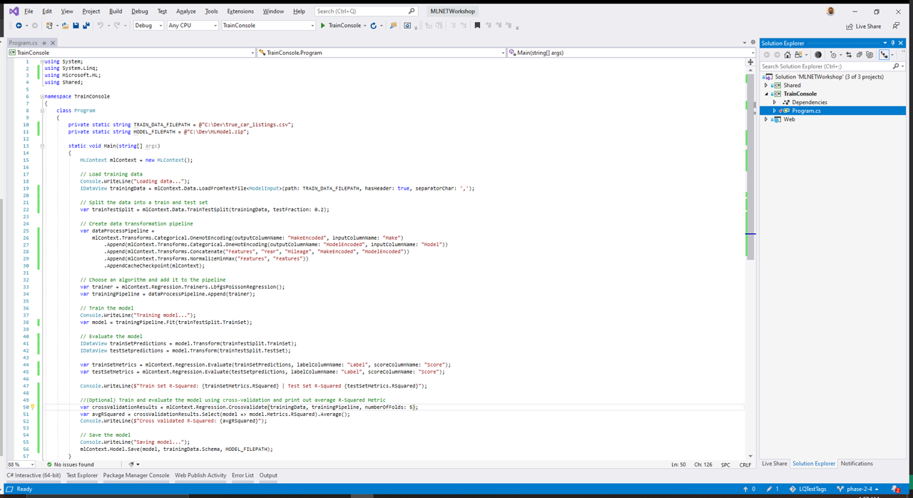

In this section you'll learn how to serialize and save the trained model for deployment and later use in other applications.

If you were not able to complete the last section, use this version of the code as the [starting point](https://github.com/luisquintanilla/mlnet-workshop-guide/archive/2-3.zip).

At the top of the *Program.cs* class, define the path of where you want your model saved to. The model is serialized and stored as a `.zip` file. In this case, the model will be saved to a file called *MLModel.zip*.

```csharp
private static string MODEL_FILEPATH = @"C:\Dev\MLModel.zip";
```

Then, inside the `Main` method, add the following code at the bottom of the `Main` method:

```csharp
// Save model
Console.WriteLine("Saving model...");
mlContext.Model.Save(model, trainingData.Schema, MODEL_FILEPATH);
```



Run the application. Navigate to the directory where you saved your model and make sure that the file is there. Once you've saved your model, you can consume it in another application (Desktop, Web, Mobile).