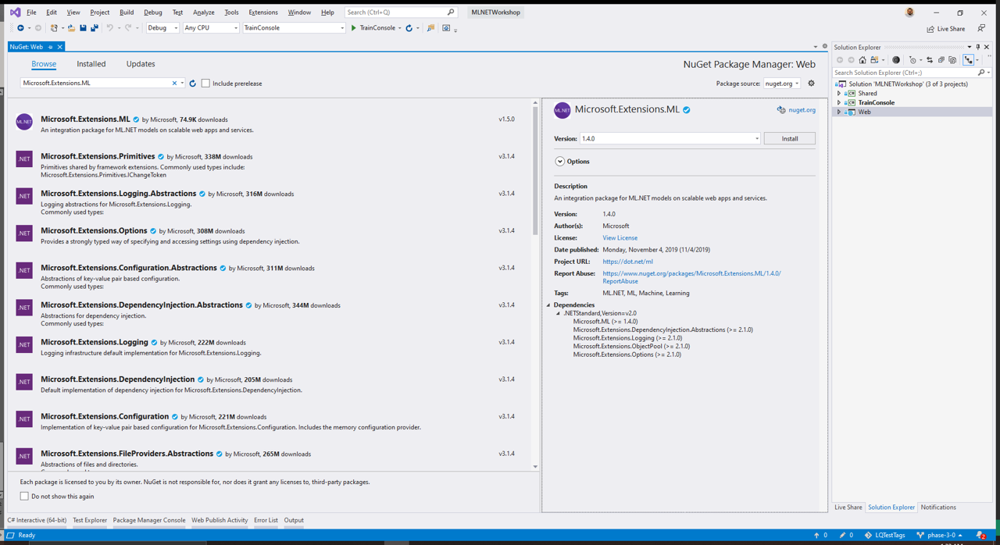

One of the advantages of ML.NET is you have different deployment targets. Perhaps you're used to building desktop, mobile and web applications in .NET. All of these are potential deployment targets for your model.

## Install Microsoft.Extensions.ML package

Install the `Microsoft.Extensions.ML` NuGet package to the `Web` project. Make sure to select version **1.5.1**.



Alternatively, you can use the dotnet cli

```dotnetcli
dotnet add package Microsoft.Extensions.ML -v 1.5.1
```

During evaluation, we used the `Transform` method to make multiple predictions on the training and test dataset. The `Transform` method is a great way to make predictions on an entire `IDataView`. However, when you want to make a single prediction, you can use the `PredictionEngine` convenience API which takes in a single instance of an object used as your model's input. In this case, you can pass in a single `ModelInput` instance instead of having to create an `IDataView` for a single data point. A challenge with `PredictionEngine` though is that it's not thread-safe. As a result, when you want to scale `PredictionEngine` in multi-threaded environments, it's recommended that you use the `PredictionEnginePool` service that's part of the `Microsoft.Extensions.ML` NuGet package.