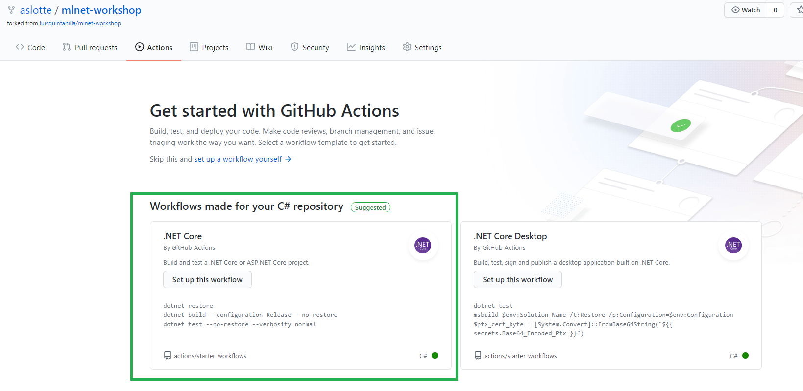
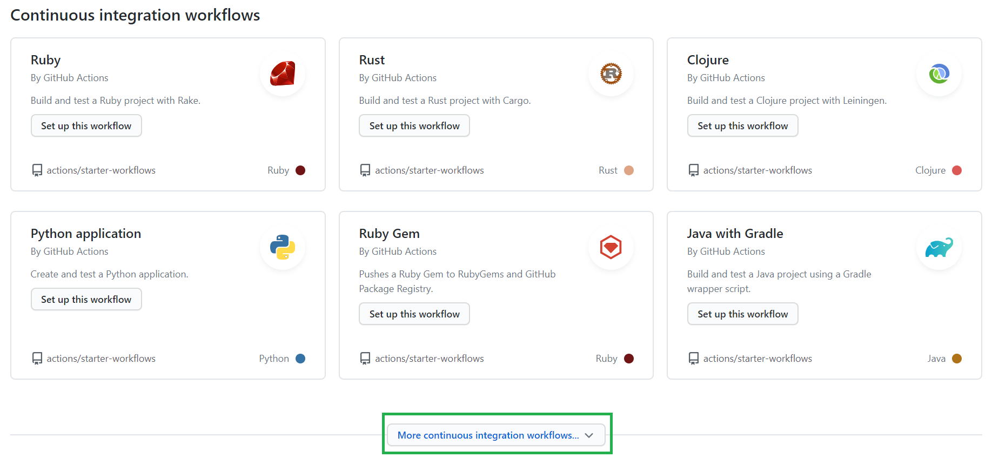

The first thing you will do is create a simple GitHub Actions workflow which will be triggered to train a new model when a commit is pushed to your repository.

To do so, navigate to your forked repo and click on the `Actions` tab. On the page that appears, go ahead and select to set up a new .NET Core workflow. 



You may need to scroll down to the "Continuous integration workflows" section and select "More continuous integration workflows..." to find the .NET Core workflow.



GitHub will provide you with a template workflow that is intended to restore, build, and test a .NET Core app. 

Replace the workflow file with the following content and commit it to your master branch.

```
name: .NET Core

on:
  push:
    branches: [ master ]
  pull_request:
    branches: [ master ]
  
jobs:
  build:

    runs-on: ubuntu-latest

    steps:        
    - uses: actions/checkout@v2
    - name: Setup .NET Core
      uses: actions/setup-dotnet@v1
      with:
        dotnet-version: 3.1.101   
    - name: Install dependencies
      run: dotnet restore src/MLNETWorkshop.sln
    - name: Build
      run: dotnet build src/MLNETWorkshop.sln --configuration Release --no-restore
``` 

If all goes well, a successful build should complete in less than a minute.

