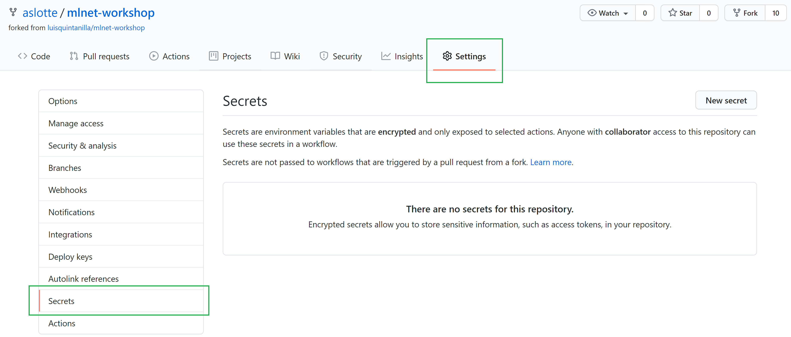

Great work, we are now able to compile our training project as part of our CI pipeline to ensure the integrity of our system. The next step is to automatically kick-off the training of our machine learning model. Before we can do that, we do we need to address an issue, which is the location of our training data. So far in this workshop you have had your training data available on disk, as part of the GitHub repository. However, in many cases the training data is of 1-100GB, which makes it non-feasible to store it in GitHub.

One way to solve this problem is to upload our data to an Azure FileShare and mount the fileshare on our Ubuntu build agent as part of each build so that the training application can access it. An Azure FileShare can handle concurrent load meaning that multiple build agents can read the data simultaneously. 

In order to achieve this we need to do two things:
1) Change the path to our data
2) Mount the fileshare as part of our Github workflow

### Change the path to our data
Navigate to the `Program.cs` file and change the `TRAIN_DATA_PATH` variable to:
```
  private static string TRAIN_DATA_FILEPATH = @"/media/data/true_car_listings.csv";
```

In addition, we'll also need to change the path to where we store our model. To do so, change the `MODEL_FILEPATH` variable to:
```
  private static string MODEL_FILEPATH = MLConfiguration.GetModelPath();
```

What this will do is to store the model on the fileshare, with a unique id matching the Git commit SHA.
Commit the changes to your master branch and push the changes to your repo.

### Mount the fileshare as part of our GitHub workflow
To mount the fileshare as part of our workflow, open the `dotnet-core.yml' file located under `.github/workflows in your repo. 
Add the following just before the `Install dependencies` step and commit and push the changes to your master branch.

```
 - name: 'Create mount points'
      run: 'sudo mkdir /media/data'
    - name: 'Map disk drive to Azure Files share folder'
      run: 'sudo mount -t cifs //ndcmelbourne.file.core.windows.net/data /media/data -o vers=3.0,username=ndcmelbourne,password=${{ secrets.STORAGEKEY }},dir_mode=0777,file_mode=0777'
```

Your complete `dotnet-core.yml` file should now look like:

```
name: .NET Core

on:
  push:
    branches: [ master ]
  pull_request:
    branches: [ master ]
  
jobs:
  build:

    runs-on: ubuntu-latest

    steps:        
    - uses: actions/checkout@v2
    - name: Setup .NET Core
      uses: actions/setup-dotnet@v1
      with:
        dotnet-version: 3.1.101   
    - name: 'Create mount points'
      run: 'sudo mkdir /media/data'
    - name: 'Map disk drive to Azure Files share folder'
      run: 'sudo mount -t cifs //ndcmelbourne.file.core.windows.net/data /media/data -o vers=3.0,username=ndcmelbourne,password=${{ secrets.STORAGEKEY }},dir_mode=0777,file_mode=0777'    
    - name: Install dependencies
      run: dotnet restore src/MLNETWorkshop.sln
    - name: Build
      run: dotnet build src/MLNETWorkshop.sln --configuration Release --no-restore

```

To mount the fileshare, we will also need to add the access key to the Azure Storage Container as a GitHub secret.
To add a secret, navigate to the `Settings` tab and select `Secrets` in the left menu:



Click on `New Secret` and add a new secret with the name of `STORAGEKEY`. The value will be provided to you by the facilitators of the workshop.