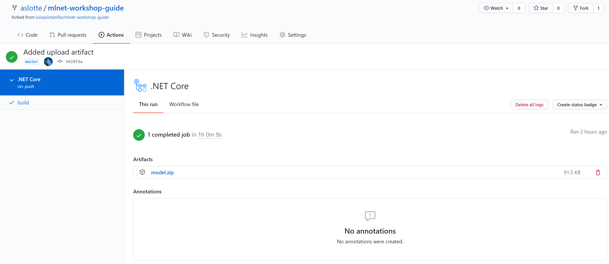

Congratulations! Your CI workflow is looking fantastic. In a real-world example, we would now do two things:
1) Register our model in a model repository of our choosing
2) Implement a CD workflow to automatically deploy our model to a test environment

There are several ways we can deploy our model, e.g. in a Docker Container, embedded in an ASP.NET Core API or simple uploaded to an Azure Storage Container which can be consumed by an application elsewhere. Since we don't want to require an Azure subscription as part of this workflow, we're going to finalize this phase by uploading the model as a build artifact, such that we can always come back to this build and grab this version of the model if needed.

To do so, add the following to the `dotnet-core.yml` file, right at the end:

```
    - name: Upload model as artifact
      uses: actions/upload-artifact@v2
      with:
        name: model.zip
        path: /media/data/${{ github.run_id }}.zip
```

Your complete `dotnet-core.yml` file should now look like: 

```
name: .NET Core

on:
  push:
    branches: [ master ]
  pull_request:
    branches: [ master ]
  
jobs:
  build:

    runs-on: ubuntu-latest

    steps:        
    - uses: actions/checkout@v2
    - name: Setup .NET Core
      uses: actions/setup-dotnet@v1
      with:
        dotnet-version: 3.1.101   
    - name: 'Create mount points'
      run: 'sudo mkdir /media/data'
    - name: 'Map disk drive to Azure Files share folder'
      run: 'sudo mount -t cifs //ndcmelbourne.file.core.windows.net/data /media/data -o vers=3.0,username=ndcmelbourne,password=${{ secrets.STORAGEKEY }},dir_mode=0777,file_mode=0777'    
    - name: Install dependencies
      run: dotnet restore src/MLNETWorkshop.sln
    - name: Build
      run: dotnet build src/MLNETWorkshop.sln --configuration Release --no-restore
    - name: Data Tests
      working-directory: 'test/DataTests'     
      run: dotnet test DataTests.csproj      
    - name: Train
      working-directory: 'src/TrainConsole'
      run: dotnet run --project TrainConsole.csproj  
    - name: Model Tests
      working-directory: 'test/ModelTests'      
      run: dotnet test ModelTests.csproj    
    - name: Upload model as artifact
      uses: actions/upload-artifact@v2
      with:
        name: model.zip
        path: /media/data/${{ github.run_id }}.zip               

```
Commit and push these changes to your repository. Once the workflow build completes, you should now see an artifact named `model.zip` which contains your trained model.

