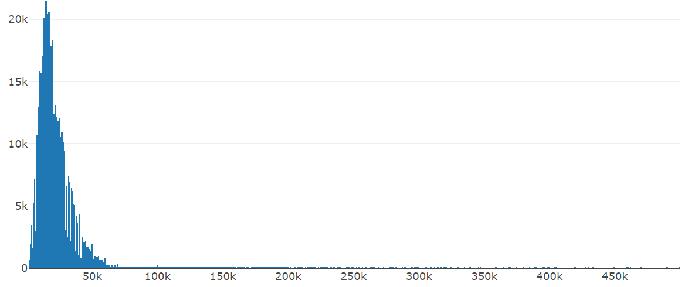
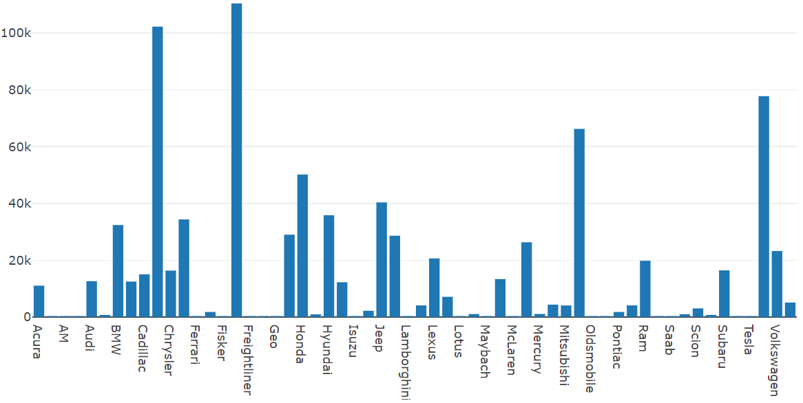

Chances are that there will be too much data in the dataset to manually go through and see any insights from it. Visualization helps in this case. We can make plots of the data in our notebook by using the [XPlot.Plotly](https://www.nuget.org/packages/XPlot.Plotly) package. However, there is no need to get this from NuGet since it is included with .NET Interactive. Since it was referenced earlier in phase 9.2 we can start using it.

In a new cell, use the below code to plot a histogram of the "Price" column.

```csharp
Chart.Plot(
    new Graph.Histogram()
    {
        x = newData.Columns["Price"]
    }
)
```



From the histogram, you can tell that most prices are around $15,000.

In another cell, run the below code to plot a bar chart of the "Make" column.

```csharp
Chart.Plot(
    new Graph.Bar
    {
        x = make.Columns["Make"],
        y = make.Columns["Price"]
    }
)
```



Since we are using the `make` variable for the visualizations, the "y" column will be a total count instead of the "Price" since we grouped the data by "Make" and got the counts of each make. 

From this chart, we can see that Ford, Chevy, and Toyota are the most popular makes.

Congratulations! You have now used the DataFrame API to analyze, pre-process, and visualize data!