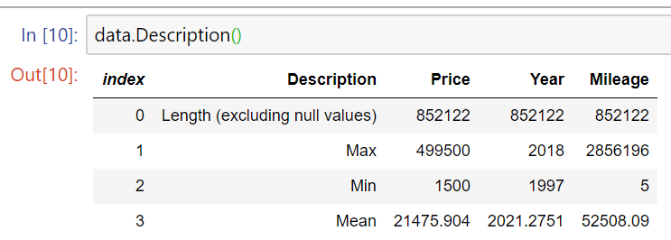

The DataFrame API has some methods that can be used to help you understand the data a bit more. In a new cell, try using the `Info` method on the data.

```csharp
data.Info()
```

This gives you what data types the DataFrame API has inferred on the columns and the number of rows for each column.


> Hint: You can see if there are any null values in a column by noticing if the number of rows don't all match.

In another cell, use the `Description` method on the data.

```csharp
data.Description()
```

This method gives you descriptive statistics such as the min, max, and mean (average) values of all of the numerical columns in the dataset.

