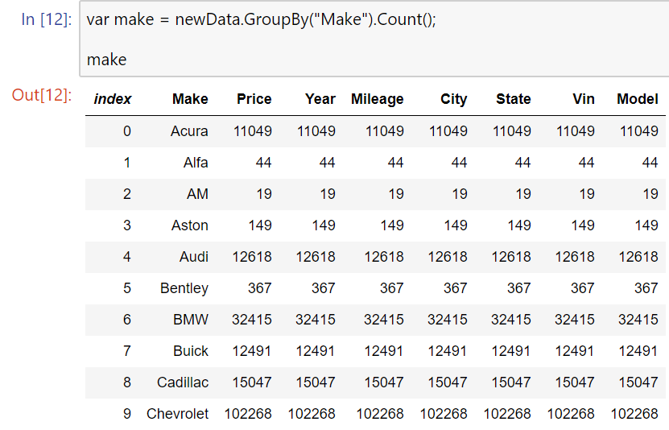
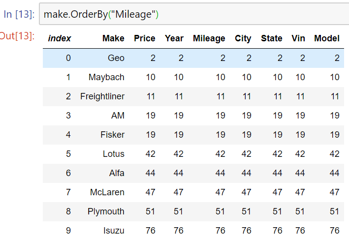
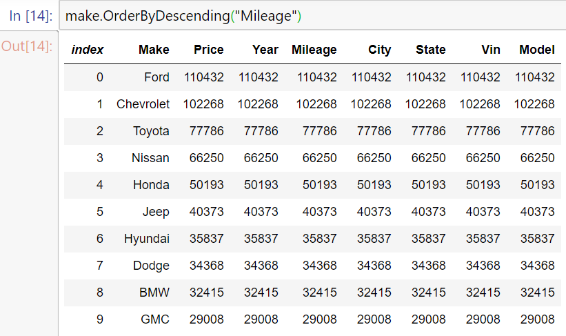

When analyzing data you will often aggregate it to get a different view of the data to help you gain some insights. The DataFrame API has several ways in which you can aggregate your data.

In a new cell, use the below code to group the data by the "Make" column and get the counts of each make.

```csharp
var make = newData.GroupBy("Make").Count();
```

In a new cell, run the `make` variable to view the top 10 rows from it. It will show all columns and they will all have the same value for each row due to counting each row with the make.



In another cell, run the below code to order the grouped data by the mileage column.

```csharp
make.OrderBy("Mileage")
```



In the next cell, use the below code to order the grouped data by mileage again, but this will order by descending values.

```csharp
make.OrderByDescending("Mileage")
``` 

